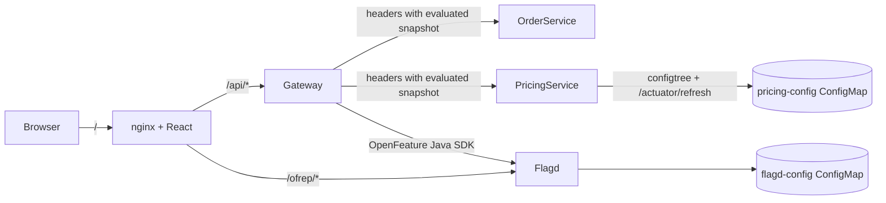

# E-commerce OpenFeature reference architecture redesign

## Problem

The current repository already demonstrates OpenFeature at the gateway, browser-side OFREP, and Spring config hot-reload, but it is framed as a hot-reload demo rather than a reusable reference for three distinct feature-flag usage patterns:

1. backend-only business flags
2. frontend-only presentation flags
3. full-stack flags that must stay semantically aligned across frontend and backend

The redesign should keep the existing technical stack (Spring Boot 3.5, Java 25, kind, flagd, React, nginx) and make the three scenarios first-class. The result must still work as a hands-on POC, including automated end-to-end verification.

## Assumptions

- Keep the current repository and technology choices; do not split into multiple repos.
- Keep flagd as the single source of truth.
- Keep OpenFeature Java at the gateway as the authoritative server-side evaluation point for request-scoped business flags.
- Keep browser-side OpenFeature only for frontend-safe flags whose targeting logic is acceptable to expose through same-origin OFREP in this demo.
- Preserve the existing `@ConfigurationProperties` refresh flow as a separate “dynamic config” capability that complements feature flags.

## Approaches considered

### 1. Scenario-first redesign inside the existing repo (**recommended**)

Reframe the existing services and UI around three explicit e-commerce scenarios. Reuse the current gateway, order-service, pricing-service, UI, and kind topology. Add a small shared evaluation layer in the gateway plus explicit scenario-oriented UI sections and E2E checks.

**Pros**
- Reuses the validated stack and scripts
- Shows how one platform supports several business patterns
- Lowest migration cost and easiest to keep runnable as a POC

**Cons**
- Some code remains demo-oriented rather than production-grade
- A few concepts need to coexist in one UI

### 2. Split into three standalone demo apps

Create separate backend-only, frontend-only, and full-stack examples under one monorepo.

**Pros**
- Strong conceptual isolation
- Each scenario can be simpler internally

**Cons**
- Duplicates infra, scripts, and docs
- Hides the main point: one architecture can support multiple business scenarios
- Larger maintenance burden

### 3. Put OpenFeature SDKs into every microservice and frontend

Each service and the UI would evaluate flags independently against flagd.

**Pros**
- Minimal gateway changes
- Easy to explain in isolation

**Cons**
- Violates the preferred request-scoped pattern for shared business flags
- Risks semantic drift and inconsistent decisions across layers
- Makes the “full-stack shared flag” story weaker, not stronger

## Recommended design

Adopt **Approach 1** and turn the repository into a **single e-commerce reference architecture** with three clearly separated scenario flows:

1. **Backend-only**: the gateway evaluates operational/business flags and forwards the result to downstream services. Only backend services consume these flags.
2. **Frontend-only**: the browser evaluates presentation-safe flags through the OpenFeature web SDK plus same-origin OFREP.
3. **Full-stack**: the gateway evaluates shared business flags for API requests, forwards them downstream, and also exposes a read model so the UI can show the same semantics without forcing downstream re-evaluation.

## Target architecture

### Components

#### Gateway

- Extract evaluation into a dedicated resolver/service so the same code path can be reused by:
  - downstream header injection
  - a UI-facing snapshot endpoint for shared flags
- Keep `setProvider(...)` non-blocking behavior
- Continue to build `EvaluationContext` from trusted request headers

#### order-service

- Continue to consume propagated flags through `ScopedValue<FeatureFlags>`
- Extend the request-scoped snapshot to include one backend-only flag
- Surface backend-only decisions in the response so the demo can prove the flow

#### pricing-service

- Continue to consume only propagated shared flags plus hot-reloadable config
- Keep `PricingConfig` mutable and getter-based for `/actuator/refresh` rebinding

#### UI

- Split the page into three scenario sections:
  - frontend-only flags
  - backend-only flow trigger and result
  - full-stack consistency view
- Keep OpenFeature web SDK usage for frontend-only presentation flags
- Fetch a gateway-produced snapshot for shared business flags and render it beside backend API results

## Flag taxonomy

### Backend-only flags

These affect service behavior only and should never be directly consumed by the browser:

- `ops-fulfillment-mode`: selects the order fulfillment path (`standard`, `express`)

### Frontend-only flags

These are safe to evaluate in the browser and affect presentation only:

- `ui-homepage-banner`: banner variant such as `control` / `spring-sale`
- `ui-member-perks`: boolean toggle for a promotional perks card

### Full-stack flags

These represent user/business semantics that both UI and backend may need to display, but the backend remains authoritative for API execution:

- `order-tier`: `standard` / `premium`
- `new-pricing-algo`: `false` / `true`

## Request flows

### 1. Backend-only flow

1. Request enters the gateway with trusted user/tenant headers.
2. Gateway evaluates `ops-fulfillment-mode`.
3. Gateway injects `X-FF-Fulfillment-Mode` into downstream requests.
4. order-service binds the value into `ScopedValue<FeatureFlags>`.
5. Business code picks a fulfillment route without any OpenFeature dependency.
6. Response exposes the chosen route so E2E can verify the scenario.

### 2. Frontend-only flow

1. Browser initializes OpenFeature web SDK with same-origin OFREP.
2. Browser evaluates `ui-homepage-banner` and `ui-member-perks`.
3. UI changes banner/perks content reactively when context or flag config changes.
4. Backend services are not involved in this decision path.

### 3. Full-stack flow

1. UI sends API requests with user/tenant headers through nginx to the gateway.
2. Gateway evaluates `order-tier` and `new-pricing-algo`.
3. Gateway forwards those values to downstream services via `X-FF-*` headers.
4. order-service and pricing-service consume only the propagated snapshot.
5. UI also calls a gateway snapshot endpoint to show the current shared semantics for the same user context.
6. The POC verifies that UI-visible shared semantics and backend results remain aligned.

## Error handling and degradation

- If flagd is temporarily unavailable, gateway evaluations must continue returning documented defaults rather than preventing startup.
- Frontend-only OFREP failures should degrade to defaults plus a visible error message in the UI.
- Shared snapshot endpoint should return explicit JSON values, not partial omissions, so the UI has deterministic defaults.
- Downstream services must continue to default missing propagated headers to safe fallback values.

## Documentation and UX changes

- Rewrite `README.md` around the three scenario model instead of only the hot-reload walkthrough.
- Keep the dynamic config refresh section as a companion capability, not a fourth flag scenario.
- Update the UI labels and API payloads so each scenario reads like an e-commerce example rather than a generic flag experiment.

## Automated verification

The POC will be considered complete only if the automation proves all of the following:

1. **Backend-only**: a request through the gateway causes order-service to select the expected fulfillment path from a propagated backend-only flag.
2. **Frontend-only**: the browser-facing OFREP endpoint returns the expected banner/perks values for at least two contexts.
3. **Full-stack**: the shared snapshot endpoint and backend API responses agree on `order-tier` / `new-pricing-algo` semantics for the same user context.
4. **Hot-reload**: changing the ConfigMap updates flag-driven behavior without pod restarts, and pricing config still rebinds in place after `/actuator/refresh`.

Verification will stay shell-driven (`curl`, `jq`, `kubectl`) by extending the existing `scripts/e2e-demo.sh` into a stricter, assertion-based scenario runner rather than introducing a separate test framework.

## Planned implementation changes

1. Add a gateway flag snapshot resolver and a controller for shared snapshot reads.
2. Extend propagated headers and downstream `FeatureFlags` records with a backend-only fulfillment flag.
3. Add new flag definitions to `k8s/flagd/configmap.yaml` for frontend-only and backend-only scenarios.
4. Rework the React UI into three scenario sections and consume:
   - OFREP for frontend-only flags
   - gateway snapshot endpoint for shared flags
   - existing backend APIs for server behavior
5. Update README and scenario naming to match the new reference-architecture framing.
6. Strengthen `scripts/e2e-demo.sh` so it asserts each scenario instead of only printing outputs.

## Out of scope

- Replacing kind with a managed cluster
- Adding a centralized config server
- Introducing a separate frontend test runner
- Promoting OpenFeature SDKs into downstream services
